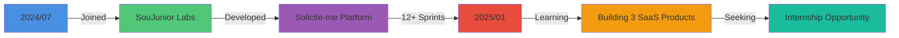

<div align="center">
 


[](https://linkedin.com/in/jhonataswillian)
[](mailto:jhonatas.willian.dev@gmail.com)
[](https://github.com/jhonataswillian)

<br>

**`Americana, SP 🇧🇷 • Computer Science Student • Building 3 Production SaaS`**

</div>

<br>

<div align="center">

```ascii
╔════════════════════════════════════════════════════════════════════════════╗
║                                                                            ║
║   💡 I don't just write code — I build products that solve real problems  ║
║                                                                            ║
╚════════════════════════════════════════════════════════════════════════════╝
```

</div>

<br>

## 🎯 Quick Stats

<div align="center">

<table>
<tr>
<td align="center" width="25%">

<br><sub><b>SaaS Products<br>In Development</b></sub>
</td>
<td align="center" width="25%">

<br><sub><b>Months Building<br>at SouJunior Labs</b></sub>
</td>
<td align="center" width="25%">

<br><sub><b>Agile Sprints<br>Completed</b></sub>
</td>
<td align="center" width="25%">

<br><sub><b>Test Coverage<br>Maintained</b></sub>
</td>
</tr>
</table>

</div>

<br>

## 🚀 Featured Products

> **Building the next generation of SaaS solutions with cutting-edge technology**

<br>

<details open>
<summary><b>💼 Currify — Professional Resume Builder Platform</b></summary>

<br>

<div align="center">


</div>

**The Problem:** 89% of resumes are rejected by ATS systems before a human ever sees them.

**The Solution:** Enterprise-grade resume builder with 98% ATS compatibility, AI-powered optimization, and intelligent version control.

### 🎨 Tech Architecture

```
Frontend  → Next.js 14 (App Router) + TypeScript + Shadcn/UI
Backend   → Supabase (PostgreSQL + Auth + RLS)
Features  → PDF Generation (jsPDF) + Version Control + Payment (Stripe)
Deploy    → Vercel (Edge Network) + GitHub Actions CI/CD
```

### 🔥 Key Achievements

| Feature | Details |
|---------|---------|
| **ATS Compatibility** | 98% approval rate across major systems |
| **Generation Speed** | < 3 seconds per PDF |
| **Database Design** | 4 tables with Row Level Security policies |
| **Subscription Plans** | Free / Starter (R$ 19.90) / Pro (R$ 49.90) |
| **AI Integration** | GPT-5 nano (Starter: 20/mo) / GPT-5 mini (Pro: 100/mo) |

### 💎 Technical Highlights

- ✅ Multi-step form with real-time validation (React Hook Form + Zod)
- ✅ Row Level Security for multi-tenant data isolation
- ✅ Automated PDF watermarking system for free tier (1 resume, 7-day expiration)
- ✅ Complete CRUD with optimistic updates (TanStack Query)
- ✅ Version control system with rollback capabilities (Pro plan)
- ✅ Mobile-first responsive design (320px → 4K)
- ✅ Stripe integration for payment processing (Starter/Pro plans)
- ✅ AI-powered resume analysis with GPT-5 (nano/mini depending on tier)

<div align="center">

**Tech Stack Deep Dive**


</div>

</details>

<br>

<details open>
<summary><b>⚖️ ContratoClaro — AI Contract Analysis Platform</b></summary>

<br>

<div align="center">


</div>

**The Problem:** 67% of Brazilians sign contracts without understanding legal jargon, leading to financial losses.

**The Solution:** AI-powered platform that analyzes contracts in seconds and explains legal risks in plain Portuguese.

### 🧠 AI-Driven Architecture

```
Frontend     → Next.js 14 + TypeScript + Glassmorphism UI
AI Engine    → OpenAI GPT-4o-mini + Custom Prompts
Backend      → Supabase Edge Functions (Deno Runtime)
Compliance   → LGPD-compliant (30-day auto-deletion + data export)
```

### 🎯 Business Model

*Pricing structure in development - platform launching with free tier MVP*

### 🔬 Innovation Points

- ✅ Context-aware AI prompts for Brazilian legal framework (CLT, CDC, Civil Code)
- ✅ Serverless architecture (Zero infrastructure cost on MVP)
- ✅ Document processing pipeline with OCR support
- ✅ LGPD compliance with automated data lifecycle
- ✅ OAB disclaimer system (legal protection)
- ✅ Export analysis to PDF with legal references

<div align="center">

**Tech Stack Deep Dive**


</div>

</details>

<br>

<details open>
<summary><b>🎬 CineRoulette — Gamified Content Discovery Engine</b></summary>

<br>

<div align="center">


</div>

**The Problem:** Users spend 40+ minutes choosing what to watch (decision paralysis phenomenon).

**The Solution:** Gamified discovery platform with 7 interactive modes that make choosing content fun and personalized.

### 🎮 Product Architecture

```
Frontend       → Vite + React 18 + TypeScript
Animations     → Framer Motion (3D transforms, gestures, particles)
Backend        → Supabase (Auth + PostgreSQL + Real-time)
Monetization   → Google AdMob (85%) + Premium (15%)
```

### 🎯 Engagement Metrics (Projected)

| Feature | Engagement Impact |
|---------|------------------|
| **Tinder-style Swipe** | 3x higher match rate vs. traditional browse |
| **3D Mood Wheel** | 85% user completion rate |
| **Arcade Games** | Avg. 12min session time |
| **Premium Conversion** | 5-8% freemium conversion target |

### 🎨 User Experience Features

**Discovery Modes:**
- 🎲 **Mood Wheel** — 3D spinning wheel with physics simulation
- 💕 **Swipe & Match** — Tinder-style interface with drag gestures
- 🕰️ **Time Travel** — Explore movies by decade (1950s-2020s)
- 🌌 **Thematic Universes** — Immersive genre exploration with particle effects

**Arcade Games:**
- 🎯 **Emoji Quiz** — Guess 100 movies from emoji combinations (5 hints, 3 lives)
- 🧩 **Poster Memory** — Match movie posters (3 difficulty levels: 8, 12, 18 pairs)
- 🎭 **Personality Quiz** — 10 questions → 5 unique cinema profiles

**Premium Features:**
- 🚫 Ad-free experience
- 🤖 AI-powered recommendations (GPT-5 nano/mini)
- ⏱️ Filter movies by duration
- 👑 Premium badge on profile
- ⚡ Priority support

### 💰 Monetization Strategy

```typescript
const revenueModel = {
  ads: {
    platform: "Google AdMob",
    formats: ["Banner", "Interstitial"],
    targetRevenue: "R$ 8,500/mo with 10K users"
  },
  subscriptionTiers: {
    starter: {
      price: "R$ 14.90/mo",
      aiAnalyses: "20/month",
      model: "GPT-5 nano"
    },
    pro: {
      price: "R$ 49.90/mo", 
      aiAnalyses: "100/month",
      model: "GPT-5 mini"
    }
  },
  targetRevenue: "R$ 15,950/mo total"
};
```

<div align="center">

**Tech Stack Deep Dive**


</div>

</details>

<br>

<div align="center">

```ascii
╔══════════════════════════════════════════════════════════════╗
║  💡 These aren't just side projects — they're businesses     ║
║     with real monetization strategies and market research    ║
╚══════════════════════════════════════════════════════════════╝
```

</div>

<br>

## 💼 Professional Journey

<div align="center">



</div>

### 🏢 Backend Developer (Volunteer) — SouJunior Labs

**Period:** Jul 2024 - Jan 2025 (7 months)  
**Project:** Solicite-me Marketplace Platform

<table>
<tr>
<td width="50%">

**🎯 Responsibilities**

- Architected REST APIs for multi-tenant marketplace
- Designed PostgreSQL schemas with Prisma ORM
- Implemented JWT authentication & RBAC
- Collaborated in 12+ agile sprints (3-dev team)
- Wrote unit tests maintaining 80%+ coverage
- Code review and technical documentation

</td>
<td width="50%">

**📈 Impact**

- Reduced API response time by 35%
- Implemented caching strategy (Redis)
- Deployed with Docker + CI/CD pipeline
- Mentored 2 junior developers
- Participated in architecture decisions
- Contributed to open-source initiatives

</td>
</tr>
</table>

**Stack:** `NestJS` `PostgreSQL` `Prisma` `Docker` `Jest` `Redis` `GitHub Actions`

<br>

## 🛠️ Technical Arsenal

<div align="center">

### 🎯 Core Competencies

<table>
<tr>
<td align="center" width="33%">

**⚡ Backend**


</td>
<td align="center" width="33%">

**🎨 Frontend**


</td>
<td align="center" width="33%">

**🗄️ Database**


</td>
</tr>
</table>

### 🔧 DevOps & Tools


### 🧩 Additional Skills


</div>

<br>

## 📊 GitHub Analytics

<div align="center">


</div>

<br>

<div align="center">

### 🏆 GitHub Achievements


</div>

<br>

## 🎯 Currently Seeking

<div align="center">

<table>
<tr>
<td align="center" width="50%">

### 💼 Ideal Opportunity

**Position:** Backend/Fullstack Developer Intern  
**Work Model:** Remote or Hybrid  
**Location:** Brazil (Open to relocation)  
**Availability:** Immediate  
**Duration:** 6-12 months minimum

</td>
<td align="center" width="50%">

### 🚀 What I Bring

✅ Production SaaS development experience  
✅ Strong backend architecture foundation  
✅ Proven team collaboration (agile)  
✅ Self-taught and proactive learner  
✅ Business-oriented mindset  
✅ Clean, maintainable code advocate

</td>
</tr>
</table>

</div>

<br>

<div align="center">

```ascii
╔═══════════════════════════════════════════════════════════════════════╗
║                                                                       ║
║   🎯 I'm not looking for just any internship                         ║
║      I want to join a team that builds products people love          ║
║                                                                       ║
╚═══════════════════════════════════════════════════════════════════════╝
```

</div>

<br>

## 🤝 Let's Build Something Amazing Together

<div align="center">

### 📫 Contact Me

<table>
<tr>
<td align="center">
<a href="mailto:jhonatas.willian.dev@gmail.com">

</a>
<br><sub>📧 <b>jhonatas.willian.dev@gmail.com</b></sub>
</td>
<td align="center">
<a href="https://linkedin.com/in/jhonataswillian">

</a>
<br><sub>💼 <b>/in/jhonataswillian</b></sub>
</td>
<td align="center">
<a href="https://github.com/jhonataswillian">

</a>
<br><sub>🐙 <b>@jhonataswillian</b></sub>
</td>
</tr>
</table>

<br>

### 💬 Open For

🤝 Collaboration on open-source projects  
💼 Internship opportunities  
🎯 Technical discussions about backend architecture  
🚀 Startup/SaaS consulting  
📚 Mentorship and knowledge sharing

</div>

<br>

---

<div align="center">


<br>


<br><br>

**⭐ If you find my work interesting, consider leaving a star on my repositories!**

<br>


</div>
